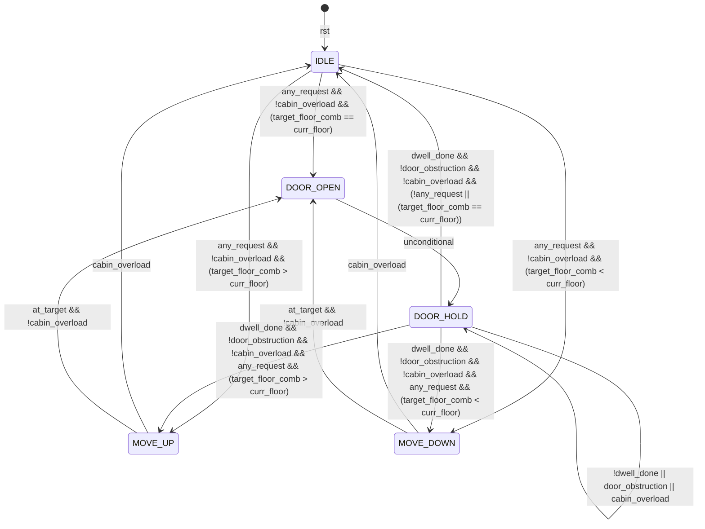
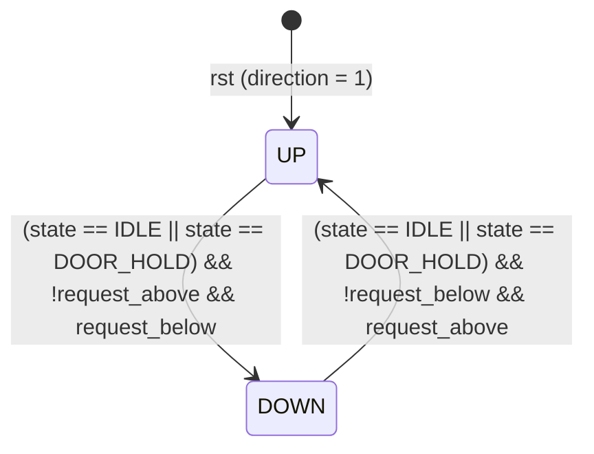

# Lift Controller FSM Diagrams

This document outlines the state transition behavior for the parameterized lift controller (`lift_controller`).

## 1. Main Control FSM

The main control FSM coordinates lift movement and door control states. It is implemented in [lift_controller.v](file:///home/tyler/workspace/lift_controller/lift_controller.srcs/sources_1/new/lift_controller.v).

### State Definitions
* **IDLE (`3'b000`)**: Cabin is stationary with doors closed.
* **MOVE_UP (`3'b001`)**: Cabin is moving upwards towards a target floor.
* **MOVE_DOWN (`3'b011`)**: Cabin is moving downwards towards a target floor.
* **DOOR_OPEN (`3'b010`)**: Door open signal is asserted, initiating dwell timer load.
* **DOOR_HOLD (`3'b110`)**: Doors remain open while the dwell timer counts down, extending if obstruction or overload occurs.

---

## 2. Direction / Scheduler State

The scheduler updates the `direction` register (`1` = UP, `0` = DOWN) during `IDLE` or `DOOR_HOLD` states.

### Direction Update Conditions
* **UP (`1'b1`)**: Transitions to `DOWN` only if there are no pending requests above the current floor and at least one pending request below.
* **DOWN (`1'b0`)**: Transitions to `UP` only if there are no pending requests below the current floor and at least one pending request above.
