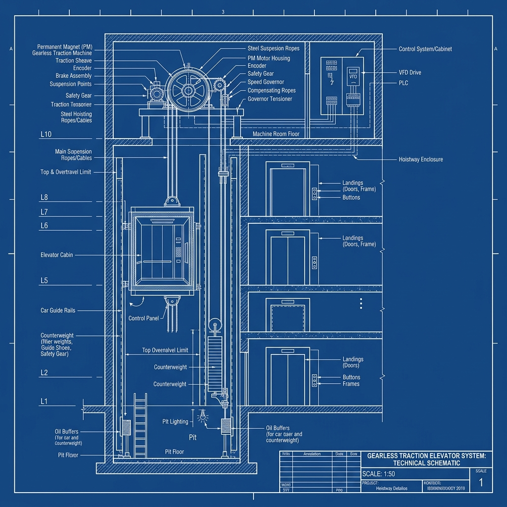
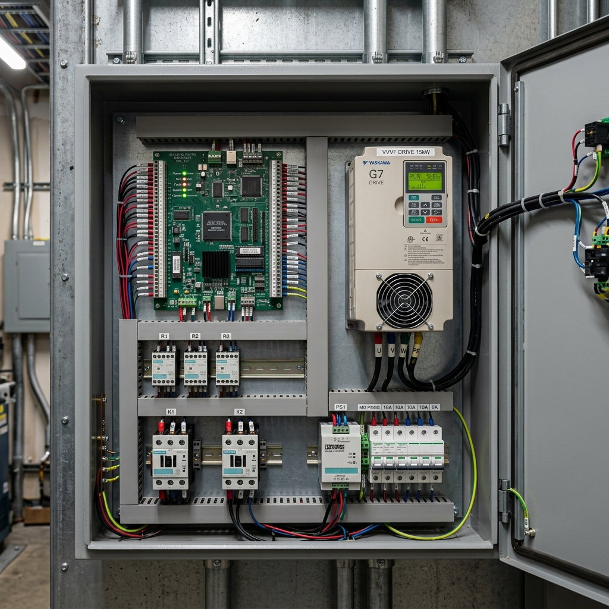

# Gearless Traction Elevator Hardware & Control Systems

This document describes the physical structure, mechanical components, and electrical control cabinet hardware for the parameterized gearless traction elevator.

---

## 1. Mechanical System and Shaft Layout

Below is the technical engineering schematic showing the elevator shaft (hoistway), cabin, counterweight, and traction machine components:

* [Traction Elevator Blueprint Source File](file:///home/tyler/workspace/lift_controller/references/traction_elevator_diagram.png)

### Key Mechanical Parts
* **Gearless Traction Machine**: Consists of a Permanent Magnet Synchronous Motor (PMSM), traction sheave, and brake assembly located in the machine room directly above the hoistway.
* **Traction Sheave**: The grooved wheel that transfers the motor torque to the hoisting ropes via friction.
* **Steel Hoisting Cables**: Support and connect the elevator cabin and the counterweight.
* **Counterweight**: Composed of cast iron weights in a steel frame. It balances the cabin load to reduce PMSM motor torque demand.
* **Guide Rails**: Steel T-sections installed vertically on both sides of the hoistway to guide the cabin and counterweight.
* **Safety Gear (Governor)**: A mechanical overspeed detection system. If the cabin moves too fast, the governor trips, engaging mechanical wedges on the cabin guide rails to halt the cabin.
* **Oil Buffers**: Safety shock absorbers situated at the bottom of the elevator pit to cushion impact if the cabin overtravels past the bottom landing.

---

## 2. Electrical Control Cabinet Hardware

The controller cabinet houses the low-voltage logic circuitry, high-power motor drives, and safety relay lines:

* [Control Cabinet Photo Source File](file:///home/tyler/workspace/lift_controller/references/elevator_control_cabinet.png)

### Cabinet Hardware Components
* **Main Logic Board**: Microcontroller or FPGA board running the [lift_controller](file:///home/tyler/workspace/lift_controller/lift_controller.srcs/sources_1/new/lift_controller.v#L12) Verilog logic. It processes hall calls, cabin calls, and floor sensor lines.
* **VVVF (Variable Voltage Variable Frequency) Drive**: The power inverter module. It converts AC main power to variable voltage and frequency to drive the PMSM traction machine, allowing smooth acceleration, deceleration, and leveling.
* **Electromagnetic Brake Relays (R1, R2, R3)**: Interlocked control relays that control power to the traction machine's mechanical brakes.
* **Contactors (K1, K2)**: Heavy-duty magnetic contactors that disconnect the VVVF drive output from the traction motor during idle states or emergency stop conditions.
* **Power Supply (PS1)**: Step-down transformer and DC regulator providing 24VDC and 5VDC to the sensors, logic board, and relay coils.
* **Circuit Breakers**: Overcurrent protection units for low-voltage control lines and high-voltage power phases.

---

## 3. Reference Media
* **Primary System Reference Video**: [Jared Owen - How does an Elevator work?](https://youtu.be/rKp4pe92ljg?si=XGNmcdxpCcgprzD7) (MRL traction elevator design reference).
